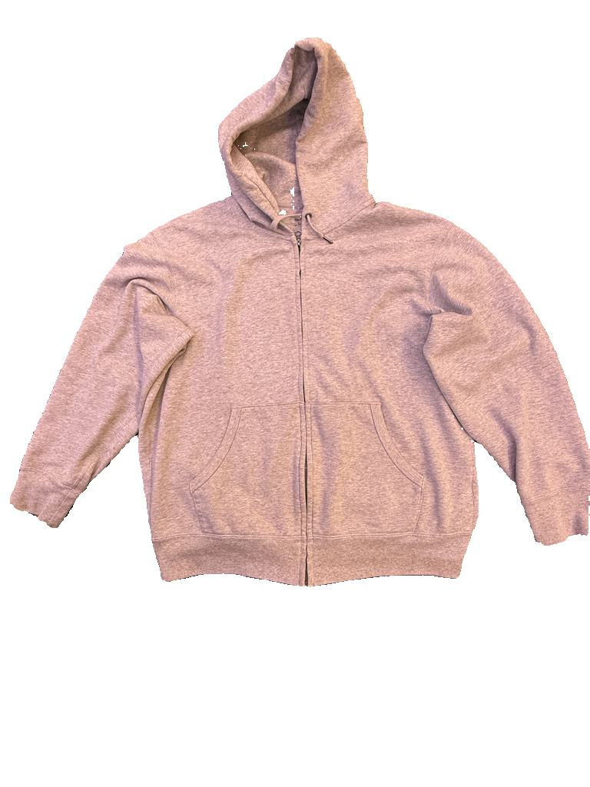
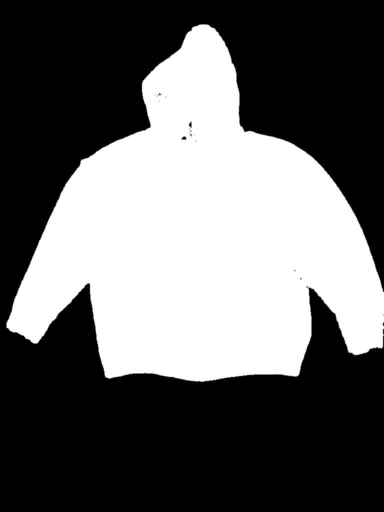
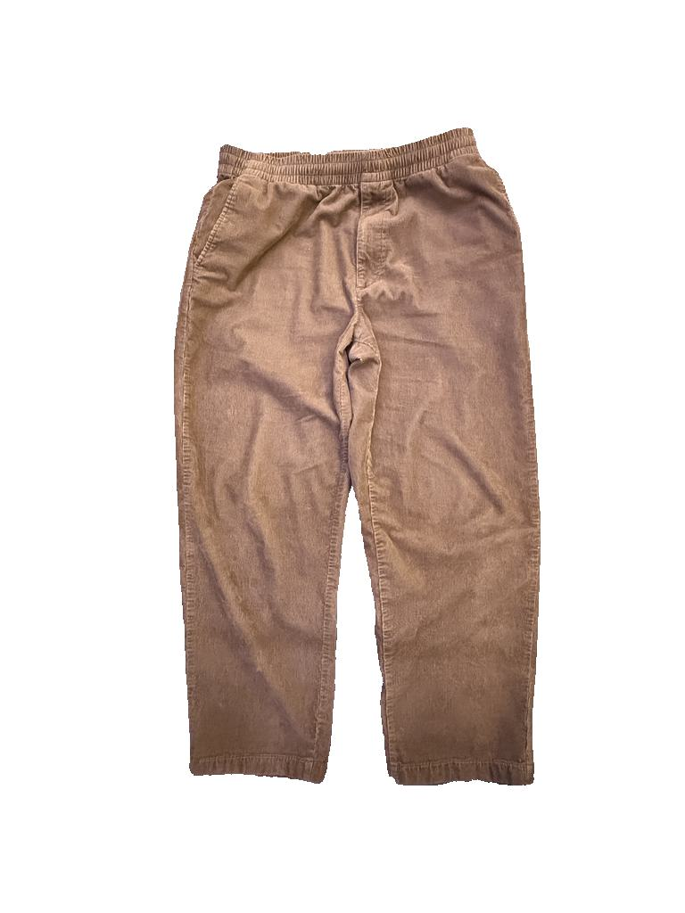
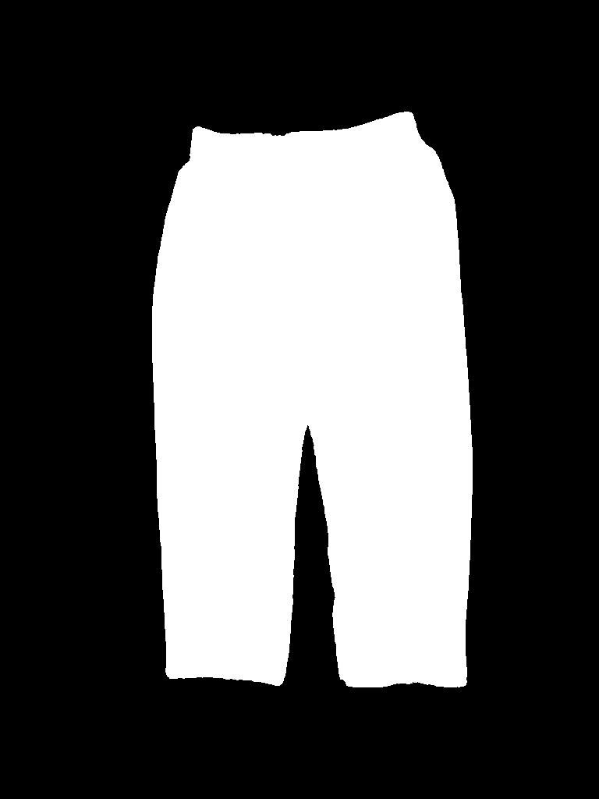
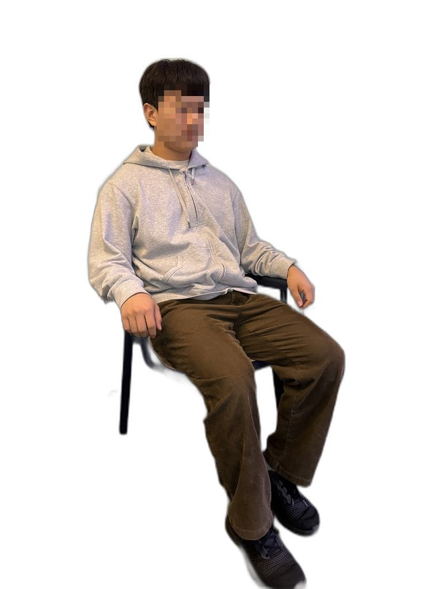

# VTON-project


## 파인튜닝을 위한 데이터셋 구축 (앉아있는 자세)
```
dataset/
├── cloth/
│   ├── lower_img/       
│   │   └── 00000.jpg    # 하의 이미지
│   ├── lower_mask/      
│   │   └── 00000.jpg    # 하의 이미지의 마스크
│   ├── upper_img/       
│   │   └── 00000.jpg    # 하의 이미지
│   └── upper_mask/      
│       └── 00000.jpg    # 하의 이미지의 마스크
├── image/               
│   └── 00000.jpg        # 사람 이미지지
├── image_mask_L/        # 이미지의 하반신 마스크 저장 (Lower 부분)
│   └── 00000.jpg
└── image_mask_U/        # 이미지의 상반신 마스크 저장 (Upper 부분)
    └── 00000.jpg
```

### 데이터셋 구성 예시시
| 분류                  | 원본 이미지 예시                 | 마스크 이미지 예시                          |
|-----------------------|----------------------------------|---------------------------------------------|
| **상의(Cloth Upper)** |  |  |
| **하의(Cloth Lower)** |  |  |
| **인물(Person)**      |       | <table><tr><td>하반신 마스크:<br></td><td>상반신 마스크:<br></td></tr></table> |

