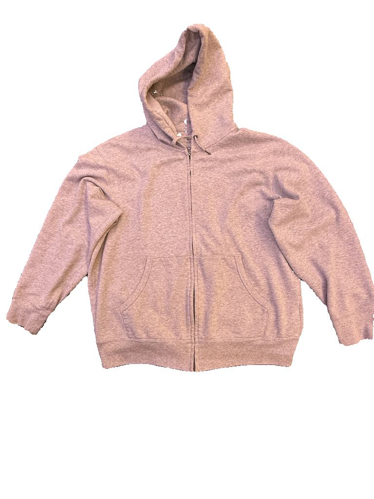
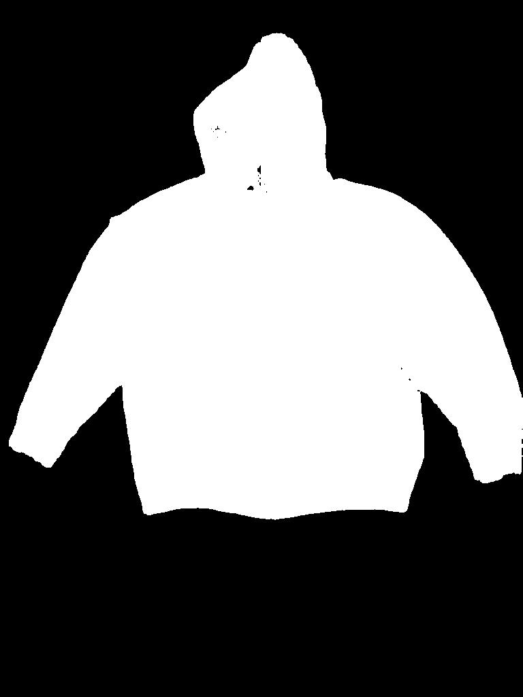
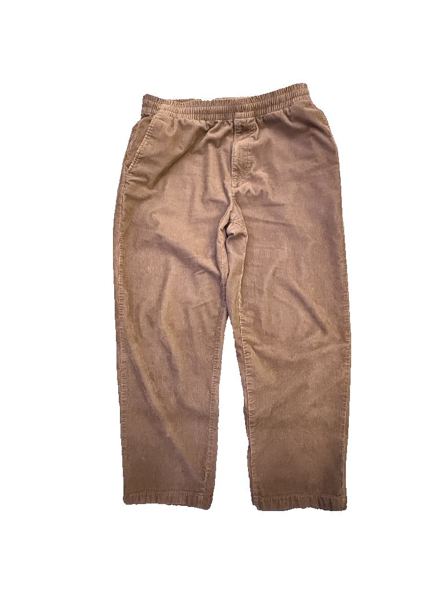
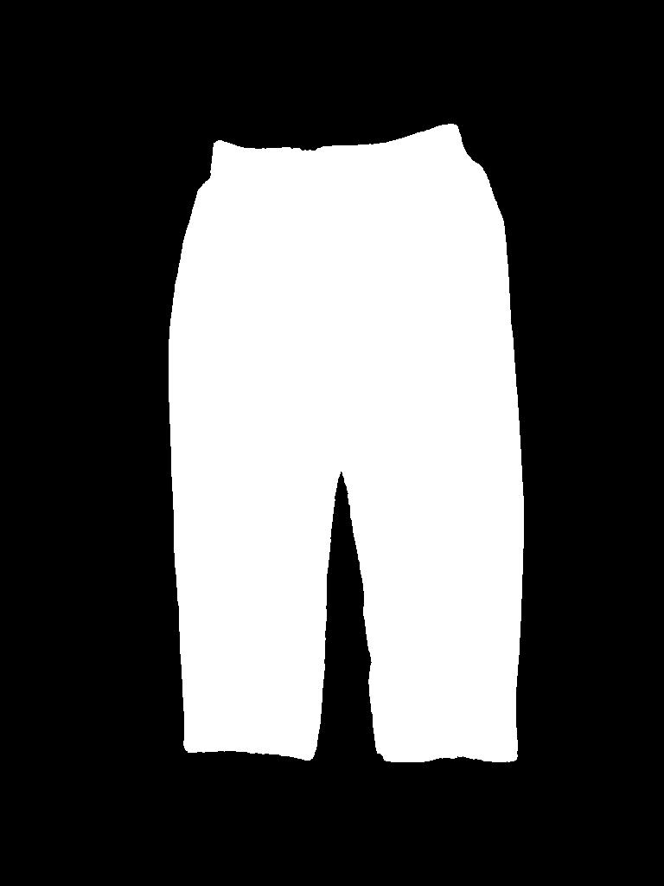
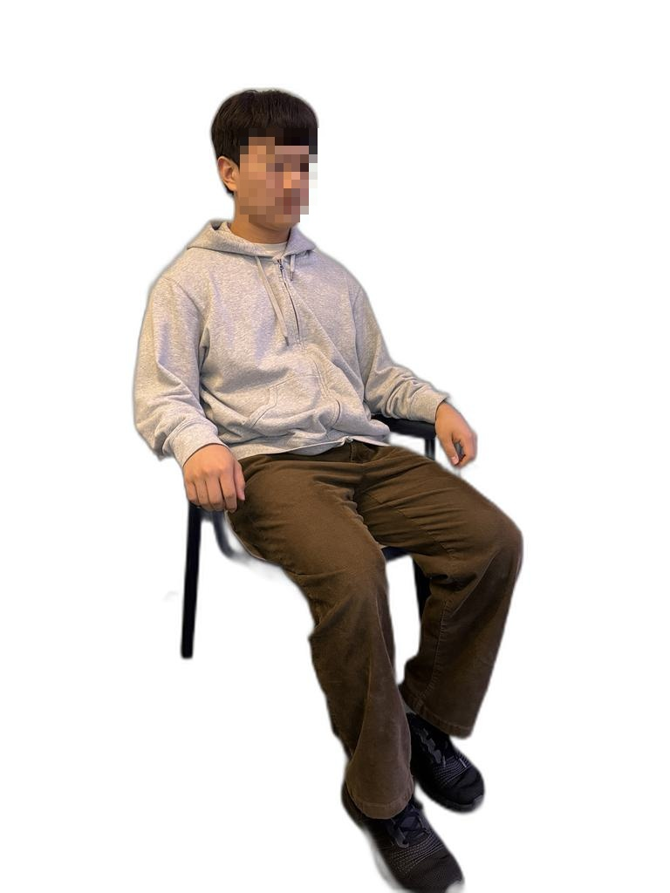
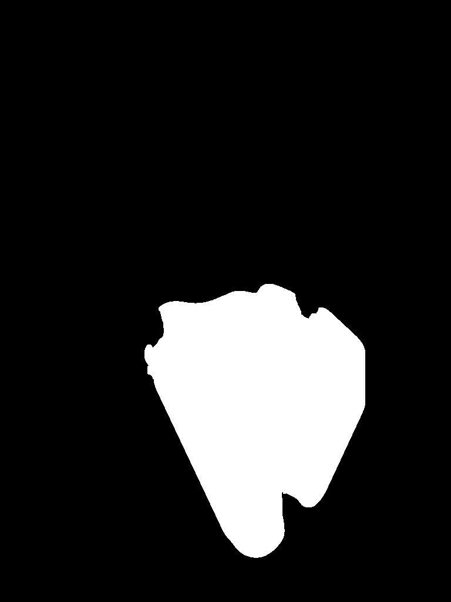

# VTON-project
**SKT FLY-AI 6기 프로젝트 _Wheel Wear_  
AI 모델 학습 및 FastAPI 배포 Repo**

_wrote by Seunghyuk Choi_  

### To-do
- docker image complete

## Project Workflow

이 리포지토리는 **데이터셋 구축 → 데이터 전처리 → 모델 학습 → 모델 서빙 → 배포**의 전체 과정을 상세하게 보여줍니다. 각 단계별로 중요한 스크립트와 노트북 파일들을 확인할 수 있습니다.

### 1. 데이터셋 구축 및 전처리
- **Notebook 폴더 (`notebook/`)**
  - 모델 공부와 데이터 전처리 과정을 인터랙티브하게 체험할 수 있는 여러 Jupyter Notebook 파일들이 포함되어 있습니다.
    1. **put_file_name_from_raw.ipynb**  
       사람이미지에 새로운 파일명을 부여하며, 이미지 회전, 사람 이미지의 경우 리사이즈 및 크롭, 옷의 경우 리사이즈 및 패딩을 진행합니다. 또한, rembg를 이용해 배경을 흰색으로 제거하는 과정을 포함합니다.
    2. **자동 마스킹 기법 실험**  
       사람 상체와 하체는 Automasker를 활용해 마스크 이미지를 생성하지만, 옷 이미지의 마스킹 성능이 부족하여 `automatic_mask_generator_example.ipynb`를 통한 sam2 기법(또는 roboflow 실험)을 적용하는 과정을 다룹니다.
    3. **얼굴 지우기 실험**  
       `make_dataset_sample_imgs.ipynb`와 `mosiac_all_person_img.ipynb`를 통해 얼굴 제거 전처리 과정을 수행합니다.
    4. **학습 샘플 페어 생성**  
       **make_train_pair.ipynb**: 사람이미지와 옷 이미지의 페어 생성을 위해 `train_unpair.txt`와 `test_unpair.txt` 파일을 생성하는 전체 과정을 확인할 수 있습니다.
    - `prove_weight_diff.ipynb`: 학습 후 가중치 차이를 검증하는 등, 모델의 성능 및 변화를 분석합니다.
  

### 2. 모델 학습
- **Toy Experiments 내 학습 스크립트**
  - 학습 코드가 CatVTON에서 제공되지 않아 직접 만드는 과정 중 생성된 파일
  - LoRA 기반 모델 학습, 손실 함수 설정, 평가 지표 계산 등의 모델 학습 과정을 다룹니다.

### 3. 모델 배포 및 추론
- **app.py**
  - FastAPI를 이용한 REST API 서버 코드로, 이미지 업로드/다운로드, 전처리, 모델 추론, 결과 이미지 저장 및 Google Cloud Storage 업로드를 담당합니다.
  - 실제 서비스 환경에서 모델 배포 및 추론 프로세스를 확인할 수 있습니다.  

## 사용된 기술 스택

- **Programming Language**: Python 3.10
- **API Framework**: FastAPI, Uvicorn
- **Machine Learning & Deep Learning**:
  - PyTorch (모델 학습, GPU 가속)
  - Hugging Face Diffusers (이미지 생성 및 inpainting)
  - PEFT (LoRA, 모델 파인튜닝)
  - PyTorch Accelerate (혼합 정밀도 및 분산 학습 지원)
- **Image Processing & Computer Vision**:
  - Pillow (이미지 처리)
  - OpenCV (영상 처리 및 변환)
  - NumPy (수치 계산)
  - rembg (배경 제거)
  - SAM2, Automasker (자동 마스킹 기법)
- **Model Evaluation**:
  - LPIPS (이미지 유사도 평가)
  - PSNR, SSIM (영상 품질 평가)
- **Experiment Tracking & Logging**:
  - wandb (실험 기록 및 모니터링)
  - MLflow (실험 메타데이터 및 모델 관리)
  - Dagshub (Git 기반 실험 관리)
  - Python의 logging 모듈
- **Data Handling & Preprocessing**:
  - Custom 데이터 전처리 스크립트 (리사이즈, 크롭, 패딩 등)
- **Deployment & Cloud Services**:
  - Docker (컨테이너 배포)
  - Google Cloud Storage (결과 이미지 저장)
- **Interactive Notebooks**:
  - Jupyter Notebook (데이터 전처리, 분석, 모델 학습 실험)
- **기타 유틸리티**:
  - Pydantic (데이터 모델 검증)
  - requests, re, time (네트워킹, 정규표현식, 시간 관리)

  
# Virtual Try-On Server
This project provides a server for a virtual try-on system, allowing users to test clothing virtually. It leverages deep learning models and is built with Python, PyTorch, and CUDA.

## Prerequisites
- **Python**: 3.10
- **CUDA**: 12.4 (Ensure NVIDIA CUDA Toolkit 12.4 is installed on your system)
- **Recommended**: Use a Conda environment for dependency management
## Setup Instructions
1. **Create and Activate a Conda Environment** (optional but recommended):
   ```bash
   conda create -n vton python=3.10
   conda activate vton
   ```
2. **How to start virtual try-on FastAPI server**
    ```
    pip install torch==2.5.1 torchvision==0.20.1 torchaudio==2.5.1 --index-url https://download.pytorch.org/whl/cu124
    git clone https://github.com/WheelWear/VTON-project.git
    pip install -r requirements.txt
    python -m uvicorn app:app --host 0.0.0.0 --port 8000
    ```
    * Use ngrok for secure tunnel from a public URL to your local machine
    
    Run this if you need original CatVTON for training
    ```
    cd VTON-project
    git clone https://github.com/Zheng-Chong/CatVTON.git
    cp pipeline_train.py CatVTON/model/
    ```
    Run with Docker
   ```
   docker pull coldbrew9/wheelwear-cu12.4-p3.10:latest
   docker run --gpus all -it -p 8000:8000 coldbrew9/wheelwear-cu12.4-p3.10:latest
   ```  
   Copying only env.json
   ```
    docker run --gpus all -it -p 8000:8000 coldbrew9/wheelwear-cu12.4-p3.10:latest 
    #마운트 안하고 json만 카피
    docker exec coldbrew9/wheelwear-cu12.4-p3.10 mkdir -p /app/VTON-project/.env  
    docker cp ./web-project-438308-a8f3849fdf23.json {container:id}/app/VTON-project/.env/web-project-438308-a8f3849fdf23.json  
    docker exec -it {container:id} bash
    uvicorn app:app --host 0.0.0.0 --port 8000 --reload   
   ```

### llm_agent.py
- recommend_size  엔드포인트


input ex.
```
{
  "brand": "나이키",
  "cloth_size": "100",
  "cloth_type" : "top",
  "gender": "남성",
  "chest_circumference": 32,
  "shoulder_width": 55,
  "arm_length": 42,
  "waist_circumference": 14
}
```

output ex.
```
{
  "recommend_size": "M",
  "additional_explanation": "최근 나이키 의류가 이전보다 크게 제작된다는 리뷰가 많으며, 사용자의 일반적인 사이즈(100)와 비교했을 때 M 사이즈가 적절할 것으로 판단됩니다.",
  "references": [
    "https://www.reddit.com/r/Nike/comments/15luox2/why_does_nike_keep_making_their_shirts_bigger/",
    "https://www.trustpilot.com/review/www.nike.com",
    "https://www.today.com/shop/nike-go-firm-support-leggings-review-rcna190644"
  ],
  "reference_num": 3
}
```


input type, output type
```
class InputData(BaseModel):
    brand: str
    cloth_size: str
    cloth_type: str
    gender: str
    chest_circumference: float
    shoulder_width: float
    arm_length: float
    waist_circumference: float

class OutputData(BaseModel):
    recommend_size: str
    additional_explanation: str
    references: list
    reference_num: int
```

## Docker
```
#docker pull base image
docker pull nvidia/cuda:12.4.1-cudnn-devel-ubuntu22.04
#docker build
docker build -t coldbrew9/wheelwear-cu12.4-p3.10:latest .
#docker run
docker run --gpus all -it -p 8000:8000 coldbrew9/wheelwear-cu12.4-p3.10:latest
```

## Run Train
```
# local train
python train_lora.py  --data_root_path ./dataset --output_dir ./experiments/ckpt --use_fp16 True --num_epochs 5 --batch_size 1 --lr 1e-4 --lora_rank 4 --accumulation_steps 4

# 코랩환경 실행
python train_lora.py  --data_root_path /content --output_dir ./experiments/ckpt --use_fp16 True --num_epochs 5 --batch_size 1 --lr 1e-4 --lora_rank 4
```

## Prepare dataset
- unzip and rename
```
unzip dataset_v{version}.zip .
mv dataset_v{version} dataset
```
## 파인튜닝을 위한 데이터셋 구축 (앉아있는 자세)
```
dataset/
├── cloth/
│   ├── lower_img/       
│   │   └── 00000.jpg    # 하의 이미지
│   ├── lower_mask/      
│   │   └── 00000.jpg    # 하의 이미지의 마스크
│   ├── upper_img/       
│   │   └── 00000.jpg    # 하의 이미지
│   └── upper_mask/      
│       └── 00000.jpg    # 하의 이미지의 마스크
├── image/               
│   └── 00000.jpg        # 사람 이미지지
├── image_mask_L/        # 이미지의 하반신 마스크 저장 (Lower 부분)
│   └── 00000.jpg
└── image_mask_U/        # 이미지의 상반신 마스크 저장 (Upper 부분)
    └── 00000.jpg
```

### 데이터셋 구성 예시시
| 분류                  | 원본 이미지 예시                 | 마스크 이미지 예시                          |
|-----------------------|----------------------------------|---------------------------------------------|
| **상의(Cloth Upper)** |  |  |
| **하의(Cloth Lower)** |  |  |
| **인물(Person)**      |       | <table><tr><td>하반신 마스크:<br></td><td>상반신 마스크:<br></td></tr></table> |

